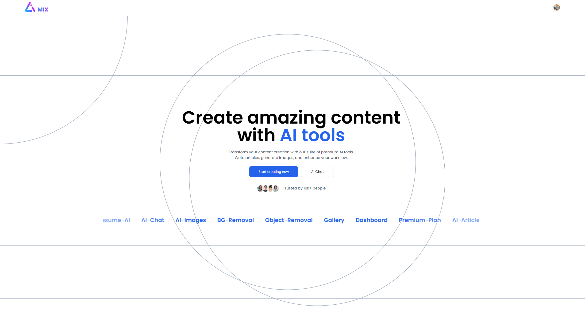
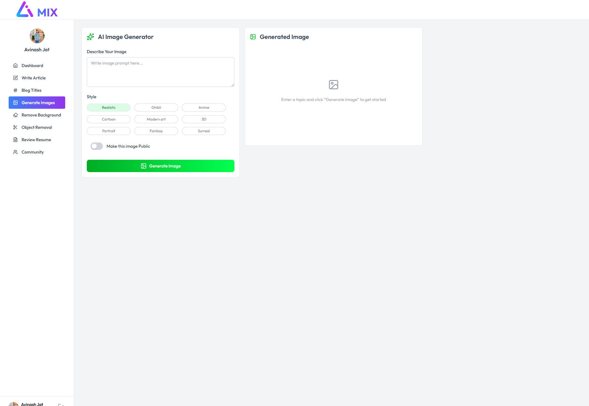

# LUMIX – AI Powered Content & Image Generation Platform

LUMIX is an AI-powered utility platform that allows users to generate content, create AI images, review resumes, and interact with an AI assistant.  
The platform integrates multiple AI services and provides a unified dashboard for creative and productivity tools.

---

## Live Demo

https://your-live-demo-link.com

---

## Project Snapshot






---


# Features

## AI Content Tools
- AI article generation with different length options
- Blog title generator based on categories
- Resume review with AI feedback and suggestions

## AI Chat Assistant
- Real-time AI chat powered by Gemini API
- Ask questions, generate ideas, or get writing help

## AI Image Generation
- Generate images using text prompts
- Multiple supported styles:
  - Anime
  - Realistic
  - Fantasy
  - Digital Art
  - Concept Art

## AI Image Editing
- Background removal using Cloudinary
- Object removal using Cloudinary AI tools

## Public Image Gallery
- Users can publish generated images
- Other users can view and like them

## Dashboard
- Shows recent AI creations
- Displays user activity and usage

## Authentication
- Secure authentication using Clerk
- Protected routes

## Subscription System
Free Plan
- Limited AI tool usage

Premium Plan
- Access to all AI tools
- Extended usage limits

---

# Tech Stack

## Frontend
- React.js
- Vite
- Tailwind CSS
- Axios
- Clerk Authentication

## Backend
- Node.js
- Express.js
- Cloudinary

## Database
- PostgreSQL

## Cloud & AI APIs
- Gemini API – AI content generation & chat
- ClipDrop API – AI image generation
- Cloudinary – Image storage, background removal, object removal

---

## Project Structure

```
LUMIX AI WEB
│
├── Client
│   ├── public
│   ├── src
│   │   ├── assets
│   │   ├── components
│   │   ├── pages
│   │   ├── App.jsx
│   │   ├── main.jsx
│   │   └── index.css
│   │
│   ├── index.html
│   └── vite.config.js
│
├── Server
│   ├── config
│   │   ├── cloudinary.js
│   │   ├── db.js
│   │   ├── multer.js
│   │   └── pdfReader.js
│   │
│   ├── controller
│   │   ├── aiController.js
│   │   ├── chatController.js
│   │   └── userController.js
│   │
│   ├── middleware
│   │   └── auth.js
│   │
│   ├── routes
│   │   ├── aiRoutes.js
│   │   ├── chatRoutes.js
│   │   └── userRoutes.js
│   │
│   ├── server.js
│   └── package.json
│
└── README.md
```

---

## Installation

### Clone Repository

```bash
git clone https://github.com/yourusername/lumix-ai-web.git
cd lumix-ai-web
```

### Install Dependencies

Client

```bash
cd Client
npm install
```

Server

```bash
cd Server
npm install
```

---

## Environment Variables

Create `.env` inside **Server**

```
PORT=5000

DATABASE_URL=your_postgresql_connection

CLERK_SECRET_KEY=your_clerk_secret_key

GEMINI_API_KEY=your_gemini_key
CLIPDROP_API_KEY=your_clipdrop_key

CLOUDINARY_CLOUD_NAME=your_cloud_name
CLOUDINARY_API_KEY=your_api_key
CLOUDINARY_API_SECRET=your_secret


 Add this in frontend and backend both env 
CLERK_PUBLISHABLE_KEY=your_clerk_publish_key


```

---

## Run Project

Start backend

```bash
cd Server
npm run dev
```

Start frontend

```bash
cd Client
npm run dev
```

Open:

```
http://localhost:5173
```

---

## Author

**Avinash Jat**

Full Stack Developer  
MERN Stack | AI Integration | Web Applications
